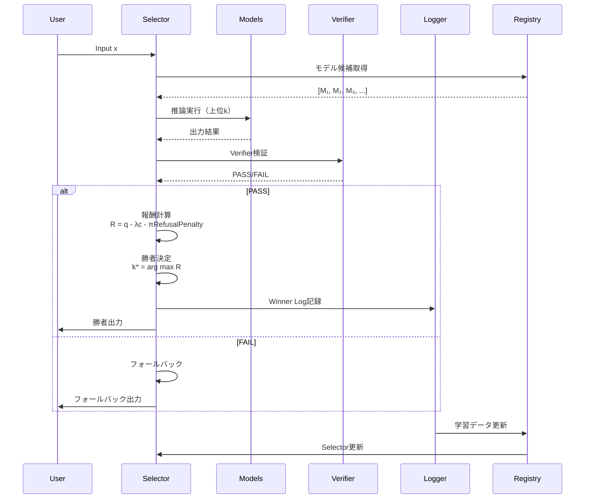

# DSL Protocol v0.1 - 実装者向け要約

このドキュメントは、DSLプロトコルを実装するために必要な最小限の情報をまとめています。
詳細は [WHITEPAPER_JP.md](WHITEPAPER_JP.md) を参照してください。

## 1. Model Manifest (model.yaml) 必須フィールド

特化モデルを登録する際に必須のメタデータです。これが欠けたモデルは登録拒否されます。

```yaml
model_id: string                    # 一意のモデル識別子
version: string                     # セマンティックバージョン（例: "0.1.0"）
base_model:
  model_id: string                  # 基礎モデルのID
  version: string                   # 基礎モデルのバージョン
  base_hash: string                 # 基礎モデルのハッシュ（sha256推奨）

artifacts:
  weights:
    filename: string                 # 差分ファイル名（LoRA/Adapter等）
    sha256: string                   # ファイルのハッシュ

license: string                     # ライセンス（例: "Apache-2.0"）

scope:
  tasks: [string]                   # 対応タスクリスト
  non_scope: [string]               # 非対応タスクリスト（重要）

io_contract:
  input:
    max_tokens: int                  # 最大入力トークン数
    required_format: string          # 入力形式（例: "prompt+schema"）
  output:
    format: string                   # 出力形式（例: "json"）
    schema_ref: string               # スキーマ参照（例: "schemas/output.schema.json"）

verifier:
  type: string                       # verifierタイプ（例: "json_schema", "unit_test"）
  pass_condition: string             # PASS条件（例: "schema_valid == true"）

routing:
  tags: [string]                     # ルーティングタグ（例: ["format:json", "task:transform"]）
  recommended_min_confidence: float  # 推奨最小信頼度（0.0-1.0）
  fallback: string                   # フォールバックモデルID
```

### サンプル

[examples/basic_manifest.yaml](examples/basic_manifest.yaml) を参照してください。

## 2. Run Log (run_log.jsonl) 必須フィールド

各推論実行のログを記録する形式です。各行はJSON形式で記録します。

```json
{
  "timestamp": "ISO8601",              // 実行時刻（例: "2025-01-01T00:00:00Z"）
  "prompt_hash": "sha256",            // プロンプトのハッシュ
  "model_id": "string",               // 使用モデルID
  "metric_version": "metric_v1",      // 使用したメトリクスバージョン（重要）
  "verifier_result": "PASS|FAIL",    // 検証結果
  "q0": 0|1,                          // Verifier PASS（0または1）
  "q1": float,                        // タスク固有スコア（0-1、オプション）
  "cost": float,                      // コストproxy（正規化済み）
  "refusal_penalty": float,           // 拒否ペナルティ（0-1）
  "reward": float,                    // 報酬値 R_k(x)
  "winner_model_id": "string"        // 勝者モデルID（学習時のみ）
}
```

### サンプル

[examples/run_log_sample.jsonl](examples/run_log_sample.jsonl) を参照してください。

## 3. Metric v1 定義

### 報酬関数

$$R_k(x) = q_0 + \beta q_1(x) - \lambda c_k(x) - \pi \cdot \mathrm{RefusalPenalty}_k(x)$$

- **$q_0 \in \{0,1\}$**: Verifier PASS（契約を満たしたか）
- **$q_1(x) \in [0,1]$**: タスク固有スコア（優劣の尺度）
- **$c_k(x)$**: コストproxy（速度など、正規化済み）
- **$\lambda$**: コスト重み（推奨: 0.3）
- **$\pi$**: 拒否ペナルティ重み（推奨: 1.0）
- **$\beta$**: $q_1$ 重み（推奨: 1.0）

### 勝者決定プロセス

$$\mathcal{C}(x) = \{k \mid V(M_k(x)) = \mathrm{PASS}\}$$

$$k^*(x) = \arg\max_{k \in \mathcal{C}(x)} R_k(x)$$

**原則**: 速度は「報酬」ではなく「コスト項」。詳細は [WHITEPAPER_JP.md](WHITEPAPER_JP.md) 4.4-4.5節を参照。

### プロトコルフロー図



## 4. Audit Set v1 形式

監査セットは、モデルの品質を検証するための入力・出力ペアの集合です。

```json
{
  "audit_id": "string",              // 監査セットID
  "version": "v1",                   // バージョン
  "test_cases": [
    {
      "input": "string",             // 入力例
      "expected_format": "json_schema|unit_test|...",  // 期待される形式
      "verifier_config": {}         // verifier設定
    }
  ]
}
```

### 用途

- モデル登録時の品質チェック
- 定期的な再評価
- メトリクス変更時の互換性確認

## 5. Stable昇格条件

モデルが experimental から stable に昇格する条件：

- Verifier通過率 ≥ 95%（過去100件）
- 勝率 ≥ 20%（過去1000件）
- 供給網検証OK（hash一致、manifest完備）

## 6. イベントタイプ

プロトコルで定義される主要イベント：

- `INFER_REQUEST` - 推論リクエスト
- `INFER_RESULT(model_id, time_ms, tokens, output_hash, verifier_score)` - 推論結果
- `SELECT_TRAIN_EXAMPLE(prompt_hash, winner_model_id)` - 学習例選択
- `MODEL_ADD_REQUEST(reason, stats_snapshot)` - モデル追加リクエスト
- `EVAL_METRIC_CHANGE(old_metric, new_metric, epoch)` - メトリクス変更

## 7. 実装チェックリスト

実装時に確認すべき項目：

- [ ] Model Manifestスキーマ準拠
- [ ] Run Log形式準拠
- [ ] Metric v1準拠（報酬関数の実装）
- [ ] Verifier実装（最低1種類）
- [ ] 勝者決定ロジック実装
- [ ] ログにmetric_versionを記録

## 8. 次のステップ

1. [examples/](examples/) のサンプルファイルを確認
2. [schemas/](schemas/) のJSON Schema定義を参照
3. [CONTRIBUTING.md](CONTRIBUTING.md) で参加方法を確認
4. Issueで実装したい機能を宣言
