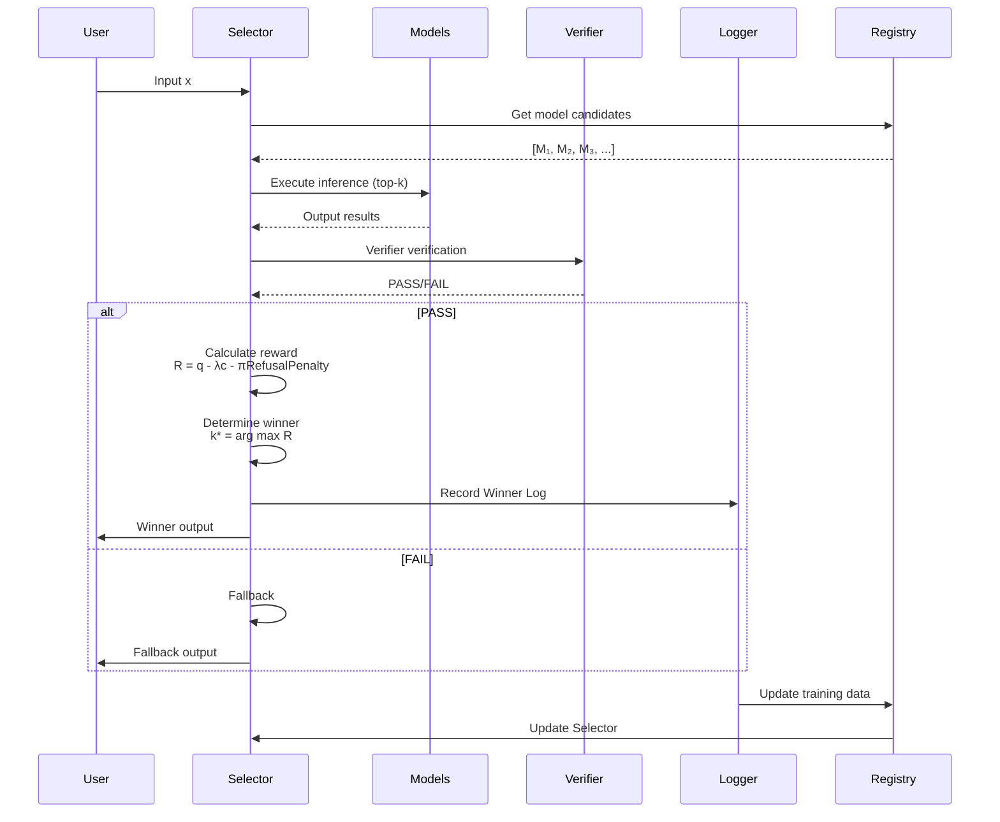

# DSL Protocol v0.1 - Summary for Implementers

This document summarizes the minimum information needed to implement the DSL protocol.
For details, see [WHITEPAPER.md](WHITEPAPER.md) or [WHITEPAPER_JP.md](WHITEPAPER_JP.md) (Japanese).

## 1. Model Manifest (model.yaml) Required Fields

Required metadata when registering a specialist model. Models missing these fields will be rejected.

```yaml
model_id: string                    # Unique model identifier
version: string                     # Semantic version (e.g., "0.1.0")
base_model:
  model_id: string                  # Base model ID
  version: string                   # Base model version
  base_hash: string                 # Base model hash (sha256 recommended)

artifacts:
  weights:
    filename: string                 # Diff file name (LoRA/Adapter, etc.)
    sha256: string                   # File hash

license: string                     # License (e.g., "Apache-2.0")

scope:
  tasks: [string]                   # Supported task list
  non_scope: [string]               # Unsupported task list (important)

io_contract:
  input:
    max_tokens: int                  # Maximum input tokens
    required_format: string          # Input format (e.g., "prompt+schema")
  output:
    format: string                   # Output format (e.g., "json")
    schema_ref: string               # Schema reference (e.g., "schemas/output.schema.json")

verifier:
  type: string                       # Verifier type (e.g., "json_schema", "unit_test")
  pass_condition: string             # PASS condition (e.g., "schema_valid == true")

routing:
  tags: [string]                     # Routing tags (e.g., ["format:json", "task:transform"])
  recommended_min_confidence: float  # Recommended minimum confidence (0.0-1.0)
  fallback: string                   # Fallback model ID
```

### Sample

See [examples/basic_manifest.yaml](examples/basic_manifest.yaml).

## 2. Run Log (run_log.jsonl) Required Fields

Format for logging each inference execution. Each line is recorded in JSON format.

```json
{
  "timestamp": "ISO8601",              // Execution time (e.g., "2025-01-01T00:00:00Z")
  "prompt_hash": "sha256",            // Prompt hash
  "model_id": "string",               // Model ID used
  "metric_version": "metric_v1",      // Metric version used (important)
  "verifier_result": "PASS|FAIL",    // Verification result
  "q0": 0|1,                          // Verifier PASS (0 or 1)
  "q1": float,                        // Task-specific score (0-1, optional)
  "cost": float,                      // Cost proxy (normalized)
  "refusal_penalty": float,           // Refusal penalty (0-1)
  "reward": float,                    // Reward value R_k(x)
  "winner_model_id": "string"        // Winner model ID (training time only)
}
```

### Sample

See [examples/run_log_sample.jsonl](examples/run_log_sample.jsonl).

## 3. Metric v1 Definition

### Reward Function

$$R_k(x) = q_0 + \beta q_1(x) - \lambda c_k(x) - \pi \cdot \mathrm{RefusalPenalty}_k(x)$$

- **$q_0 \in \{0,1\}$**: Verifier PASS (whether contract is satisfied)
- **$q_1(x) \in [0,1]$**: Task-specific score (measure of superiority)
- **$c_k(x)$**: Cost proxy (speed, etc., normalized)
- **$\lambda$**: Cost weight (recommended: 0.3)
- **$\pi$**: Refusal penalty weight (recommended: 1.0)
- **$\beta$**: $q_1$ weight (recommended: 1.0)

### Winner Selection Process

$$\mathcal{C}(x) = \{k \mid V(M_k(x)) = \mathrm{PASS}\}$$

$$k^*(x) = \arg\max_{k \in \mathcal{C}(x)} R_k(x)$$

**Principle**: Speed is a "cost term", not a "reward". See [WHITEPAPER.md](WHITEPAPER.md) sections 4.4-4.5 for details.

### Protocol Flow Diagram



## 4. Audit Set v1 Format

An audit set is a collection of input-output pairs for verifying model quality.

```json
{
  "audit_id": "string",              // Audit set ID
  "version": "v1",                   // Version
  "test_cases": [
    {
      "input": "string",             // Input example
      "expected_format": "json_schema|unit_test|...",  // Expected format
      "verifier_config": {}         // Verifier configuration
    }
  ]
}
```

### Usage

- Quality check at model registration
- Periodic re-evaluation
- Compatibility verification when metrics change

## 5. Stable Promotion Conditions

Conditions for a model to be promoted from experimental to stable:

- Verifier pass rate ≥ 95% (last 100 cases)
- Win rate ≥ 20% (last 1000 cases)
- Supply chain verification OK (hash match, manifest complete)

## 6. Event Types

Major events defined in the protocol:

- `INFER_REQUEST` - Inference request
- `INFER_RESULT(model_id, time_ms, tokens, output_hash, verifier_score)` - Inference result
- `SELECT_TRAIN_EXAMPLE(prompt_hash, winner_model_id)` - Training example selection
- `MODEL_ADD_REQUEST(reason, stats_snapshot)` - Model addition request
- `EVAL_METRIC_CHANGE(old_metric, new_metric, epoch)` - Metric change

## 7. Implementation Checklist

Items to verify during implementation:

- [ ] Model Manifest schema compliance
- [ ] Run Log format compliance
- [ ] Metric v1 compliance (reward function implementation)
- [ ] Verifier implementation (at least 1 type)
- [ ] Winner selection logic implementation
- [ ] Record metric_version in logs

## 8. Next Steps

1. Check [examples/](examples/) sample files
2. Refer to [schemas/](schemas/) JSON Schema definitions
3. Check [CONTRIBUTING_EN.md](CONTRIBUTING_EN.md) for participation guidelines
4. Declare the feature you want to implement in Issues
