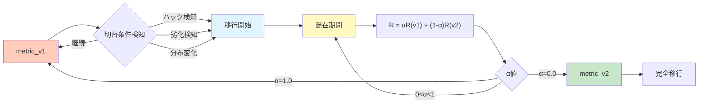
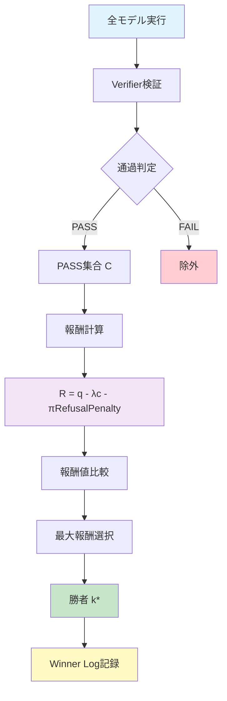

# メトリクスとAudit仕様

## 1. Metric Registry（指標バージョン管理）

proxy置換を「思想」ではなく「手順」に落とすために、Metric Registryを導入。

### バージョン管理

- **metric_v1**：速度中心
- **metric_v2**：品質proxy重視
- 以降、必要に応じて metric_v3, v4...

### ログへの記録

ログに **metric_version** を必ず記録する。

これで「途中変更＝おじゃん」を避けられます。

## 2. 移行手順

### 混在移行

一定期間、以下のように混在で行う：

R = αR(v1) + (1-α)R(v2)

- α：移行率（0から1へ段階的に変化）
- 移行期間中は両方のメトリクスを記録

#### Metric移行フロー



### 切替条件

- ハック検知
- 劣化検知
- 分布変化

## 3. 報酬関数の構成

### 基本式

$$R_k(x) = q_0 + \beta q_1(x) - \lambda c_k(x) - \pi \cdot \mathrm{RefusalPenalty}_k(x)$$

詳細な定義と理論的根拠は [WHITEPAPER_JP.md](WHITEPAPER_JP.md) 4.3-4.5節を参照。

## 4. Proxy Metrics（代理指標）

### 例

- TTFT（Time To First Token）
- TPS（Tokens Per Second）
- 総時間
- トークン数
- 拒否率
- 自己矛盾率

### 重要な原則

**Proxyを固定しない（ガバナンスとして完成）**

- 制度として固定しない
- 置換可能な設計
- バージョン管理で互換性を保つ

## 5. Audit Set（監査セット）

### audit_set_v1 の形式

監査セットは、モデルの品質を検証するための入力・出力ペアの集合。

形式（最小限）：
- 入力例
- 期待される出力形式
- 検証条件（verifier）

### 用途

- モデル登録時の品質チェック
- 定期的な再評価
- メトリクス変更時の互換性確認

## 6. Verifier（検証器）

### 役割

最小品質ゲートとして機能：
- 速いゴミ排除のための「ハード制約」
- タスク領域ごとに用意

### 種類

- JSON schema
- Unit test
- 静的解析
- ルール検査

### PASS条件

verifier の PASS条件は model.yaml に定義する：

```yaml
verifier:
  type: json_schema
  pass_condition: "schema_valid == true"
```

## 7. 勝者決定プロセス

### 手順

1. **Verifierで足切り**
   - C(x) = {k | V(Mₖ(x)) = PASS}

2. **PASS集合の中で報酬を計算**
   - 品質proxy q、コストproxy c を分離して合成

3. **勝者決定**
   - $k^*(x) = \arg\max_{k \in \mathcal{C}(x)} R_k(x)$

### 意味

- Verifier通過が前提
- 通過した中で報酬が最大のモデルが勝者
- 速度単独では勝てない

#### 勝者決定プロセス図



## 8. ログ形式

### run_log.jsonl 必須フィールド

各ログエントリには以下を含める：

- **timestamp**：実行時刻
- **prompt_hash**：プロンプトのハッシュ
- **model_id**：使用モデルID
- **metric_version**：使用したメトリクスバージョン
- **verifier_result**：検証結果（PASS/FAIL）
- **reward**：報酬値
- **proxy_values**：各proxyの値
- **winner_model_id**：勝者モデルID（学習時）

### イベントタイプ

- `INFER_REQUEST`
- `INFER_RESULT(model_id, time_ms, tokens, output_hash, verifier_score)`
- `SELECT_TRAIN_EXAMPLE(prompt_hash, winner_model_id)`
- `MODEL_ADD_REQUEST(reason, stats_snapshot)`
- `EVAL_METRIC_CHANGE(old_metric, new_metric, epoch)`

## 9. Stable昇格条件

### 条件例

- PASS率が一定閾値以上（例：95%以上）
- 一定期間の勝率が閾値以上
- verifier通過率が閾値以上
- 供給網検証に成功（hash一致、manifest完備）

### 運用

- 初期は experimental ステータス
- 条件を満たしたら stable に昇格
- stable モデルは優先的に選択される

## 10. 反証可能仮説との関係

### H1（proxyの有効性）

- **H**：同一環境で、PASS条件を満たす出力に限定すると、コストproxy（例：TTFT/TPS）は適合度と正の相関を持つ
- **T**：同一prompt集合で top-kモデルの R と proxy を記録（n≥200）
- **D**：Spearman ρ > 0.3 をPASS、ρ ≤ 0 をFAIL
- **C**：相関が出ない場合、proxyを置換（entropy/自己矛盾率等へ）
- **U**：キャッシュ・バッチ・ロード時間混入（主要誤差源）

### H2（自己組織化）

- **H**：勝者ログでLoRA微調整を回すと、特化モデルの勝率が上がり、入力分割が進む
- **T**：固定タスクで 3世代更新、勝率推移を観測
- **D**：勝率が単調増加 or 収束でPASS、単一支配でFAIL
- **C**：単一支配が起きたら探索温度/最低試行保証を強化
- **U**：verifierの弱さが最大の誤差源

## 11. 次に考える問い

「あなたのプロジェクトで"最小品質ゲート（verifier）"として採用できる、最も安くて堅いものは何か？」

ここが決まると、ホワイトペーパーが"思想"から"仕様"に昇格します。

理由：この制度の成功率は verifierの安さと堅さで決まる。
（例：コード生成＝単体テスト、JSON変換＝schema、など）
