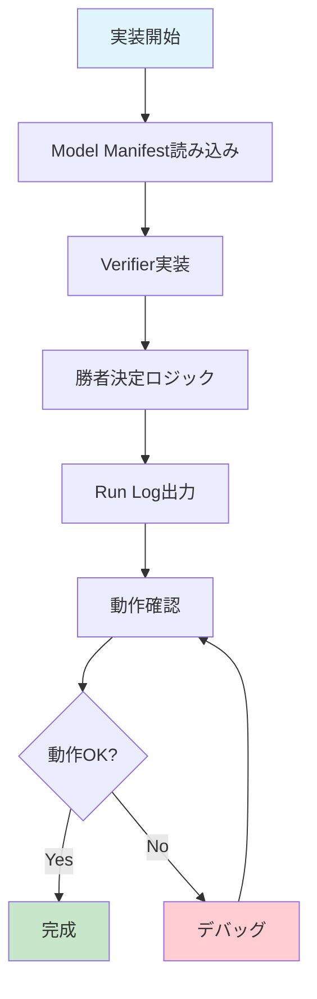

# Quick Start Guide

実装者向けの5分クイックスタートガイドです。

## 1. プロジェクトを理解する（2分）

1. [README.md](README.md) を読む - プロジェクトの概要
2. [DSL_PROTOCOL_V0_1.md](DSL_PROTOCOL_V0_1.md) を読む - プロトコル要約

## 2. サンプルを確認する（1分）

- [examples/basic_manifest.yaml](examples/basic_manifest.yaml) - Model Manifest例
- [examples/run_log_sample.jsonl](examples/run_log_sample.jsonl) - Run Log例
- [schemas/](schemas/) - JSON Schema定義

## 3. 実装を始める（2分）

### 実装フロー



### 最小実装（MVP）

以下の3つを実装すれば、基本的な動作を確認できます：

1. **Model Manifest読み込み**
   ```python
   import yaml
   with open('examples/basic_manifest.yaml') as f:
       manifest = yaml.safe_load(f)
   ```

2. **基本的なVerifier実装**
   ```python
   import json
   import jsonschema
   
   def verify_json_schema(output, schema_path):
       with open(schema_path) as f:
           schema = json.load(f)
       return jsonschema.validate(output, schema) is None
   ```

3. **Run Log出力**
   ```python
   import json
   from datetime import datetime
   
   log_entry = {
       "timestamp": datetime.now().isoformat() + "Z",
       "prompt_hash": "abc123...",
       "model_id": "spec-llm.jsonfixer",
       "metric_version": "metric_v1",
       "verifier_result": "PASS",
       "q0": 1,
       "q1": 0.71,
       "cost": 0.33,
       "refusal_penalty": 0.0,
       "reward": 1.38
   }
   
   with open('run_log.jsonl', 'a') as f:
       f.write(json.dumps(log_entry) + '\n')
   ```

### 勝者決定ロジック

詳細な理論は [WHITEPAPER_JP.md](WHITEPAPER_JP.md) 4.4-4.5節を参照。

報酬関数：$R_k(x) = q_0 + \beta q_1(x) - \lambda c_k(x) - \pi \cdot \mathrm{RefusalPenalty}_k(x)$

```python
def select_winner(models_results, lambda_cost=0.3, pi_penalty=1.0, beta=1.0):
    """
    勝者を決定する
    
    Args:
        models_results: [(model_id, verifier_result, proxy_values), ...]
        lambda_cost: コスト重み（推奨: 0.3）
        pi_penalty: 拒否ペナルティ重み（推奨: 1.0）
        beta: q1重み（推奨: 1.0）
    
    Returns:
        winner_model_id or None
    """
    # 1. Verifierで足切り（q0 = PASS/FAIL）
    passed = [
        (mid, pv) for mid, vr, pv in models_results
        if vr == "PASS"  # q0 = 1
    ]
    
    if not passed:
        return None
    
    # 2. 報酬計算（q0/q1二層化）
    rewards = []
    for model_id, proxy_values in passed:
        q0 = 1.0  # Verifier PASS
        q1 = proxy_values.get("q1", 0.0)  # タスク固有スコア
        c = proxy_values["cost"]
        rp = proxy_values.get("refusal_penalty", 0.0)
        reward = q0 + beta * q1 - lambda_cost * c - pi_penalty * rp
        rewards.append((model_id, reward))
    
    # 3. 最大報酬のモデルが勝者
    winner = max(rewards, key=lambda x: x[1])
    return winner[0]
```

## 4. 次のステップ

- [CONTRIBUTING.md](CONTRIBUTING.md) で参加方法を確認
- Issueで実装したい機能を宣言
- 実装を進める

## よくある質問

### Q: どの言語で実装すればいい？

A: 任意です。プロトコル準拠が重要です。

### Q: どこから始めればいい？

A: MVP runnerから始めることを推奨します。詳細は [CONTRIBUTING.md](CONTRIBUTING.md) を参照。

### Q: Verifierはどう実装すればいい？

A: 最初はJSON Schema検証が最も簡単です。詳細は [DSL_PROTOCOL_V0_1.md](DSL_PROTOCOL_V0_1.md) を参照。

## 参考リンク

- [WHITEPAPER_JP.md](WHITEPAPER_JP.md) - 完全版理論・仕様（v1.3）**← 主要ドキュメント**
- [DSL_PROTOCOL_V0_1.md](DSL_PROTOCOL_V0_1.md) - プロトコル要約（実装者向け）
- [SPECIALIST_MODEL_DEFINITION.md](SPECIALIST_MODEL_DEFINITION.md) - 特化モデルの定義（補足）
- [METRICS_AND_AUDIT.md](METRICS_AND_AUDIT.md) - メトリクスとAudit仕様（補足）
