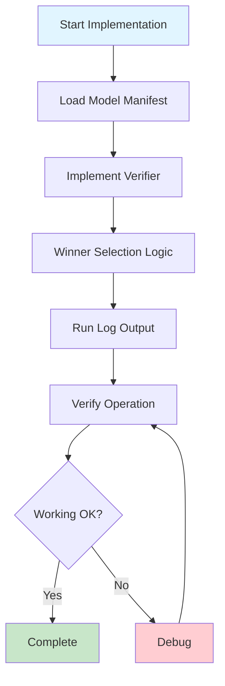

# Quick Start Guide

A 5-minute quick start guide for implementers.

## 1. Understand the Project (2 minutes)

1. Read [README_EN.md](README_EN.md) - Project overview
2. Read [DSL_PROTOCOL_V0_1_EN.md](DSL_PROTOCOL_V0_1_EN.md) - Protocol summary

## 2. Check Samples (1 minute)

- [examples/basic_manifest.yaml](examples/basic_manifest.yaml) - Model Manifest example
- [examples/run_log_sample.jsonl](examples/run_log_sample.jsonl) - Run Log example
- [schemas/](schemas/) - JSON Schema definitions

## 3. Start Implementation (2 minutes)

### Implementation Flow



### Minimum Implementation (MVP)

Implement these 3 components to verify basic operation:

1. **Model Manifest Loading**
   ```python
   import yaml
   with open('examples/basic_manifest.yaml') as f:
       manifest = yaml.safe_load(f)
   ```

2. **Basic Verifier Implementation**
   ```python
   import json
   import jsonschema
   
   def verify_json_schema(output, schema_path):
       with open(schema_path) as f:
           schema = json.load(f)
       return jsonschema.validate(output, schema) is None
   ```

3. **Run Log Output**
   ```python
   import json
   from datetime import datetime
   
   log_entry = {
       "timestamp": datetime.now().isoformat() + "Z",
       "prompt_hash": "abc123...",
       "model_id": "spec-llm.jsonfixer",
       "metric_version": "metric_v1",
       "verifier_result": "PASS",
       "q0": 1,
       "q1": 0.71,
       "cost": 0.33,
       "refusal_penalty": 0.0,
       "reward": 1.38
   }
   
   with open('run_log.jsonl', 'a') as f:
       f.write(json.dumps(log_entry) + '\n')
   ```

### Winner Selection Logic

For detailed theory, see [WHITEPAPER.md](WHITEPAPER.md) sections 4.4-4.5.

Reward function: $R_k(x) = q_0 + \beta q_1(x) - \lambda c_k(x) - \pi \cdot \mathrm{RefusalPenalty}_k(x)$

```python
def select_winner(models_results, lambda_cost=0.3, pi_penalty=1.0, beta=1.0):
    """
    Determine the winner
    
    Args:
        models_results: [(model_id, verifier_result, proxy_values), ...]
        lambda_cost: Cost weight (recommended: 0.3)
        pi_penalty: Refusal penalty weight (recommended: 1.0)
        beta: q1 weight (recommended: 1.0)
    
    Returns:
        winner_model_id or None
    """
    # 1. Filter by Verifier (q0 = PASS/FAIL)
    passed = [
        (mid, pv) for mid, vr, pv in models_results
        if vr == "PASS"  # q0 = 1
    ]
    
    if not passed:
        return None
    
    # 2. Calculate rewards (q0/q1 two-layer)
    rewards = []
    for model_id, proxy_values in passed:
        q0 = 1.0  # Verifier PASS
        q1 = proxy_values.get("q1", 0.0)  # Task-specific score
        c = proxy_values["cost"]
        rp = proxy_values.get("refusal_penalty", 0.0)
        reward = q0 + beta * q1 - lambda_cost * c - pi_penalty * rp
        rewards.append((model_id, reward))
    
    # 3. Model with maximum reward is the winner
    winner = max(rewards, key=lambda x: x[1])
    return winner[0]
```

## 4. Next Steps

- Check [CONTRIBUTING_EN.md](CONTRIBUTING_EN.md) for participation guidelines
- Declare the feature you want to implement in Issues
- Proceed with implementation

## FAQ

### Q: What language should I use for implementation?

A: Any language. Protocol compliance is what matters.

### Q: Where should I start?

A: We recommend starting with the MVP runner. See [CONTRIBUTING_EN.md](CONTRIBUTING_EN.md) for details.

### Q: How should I implement the Verifier?

A: JSON Schema validation is the easiest to start with. See [DSL_PROTOCOL_V0_1_EN.md](DSL_PROTOCOL_V0_1_EN.md) for details.

## Reference Links

- [WHITEPAPER.md](WHITEPAPER.md) - Full theory & specifications (v1.3) **← Main document**
- [WHITEPAPER_JP.md](WHITEPAPER_JP.md) - Full theory & specifications (v1.3) **← Main document**
- [DSL_PROTOCOL_V0_1_EN.md](DSL_PROTOCOL_V0_1_EN.md) - Protocol summary (for implementers)
- [SPECIALIST_MODEL_DEFINITION.md](SPECIALIST_MODEL_DEFINITION.md) - Specialist model definition (supplementary)
- [METRICS_AND_AUDIT.md](METRICS_AND_AUDIT.md) - Metrics and audit specifications (supplementary)
