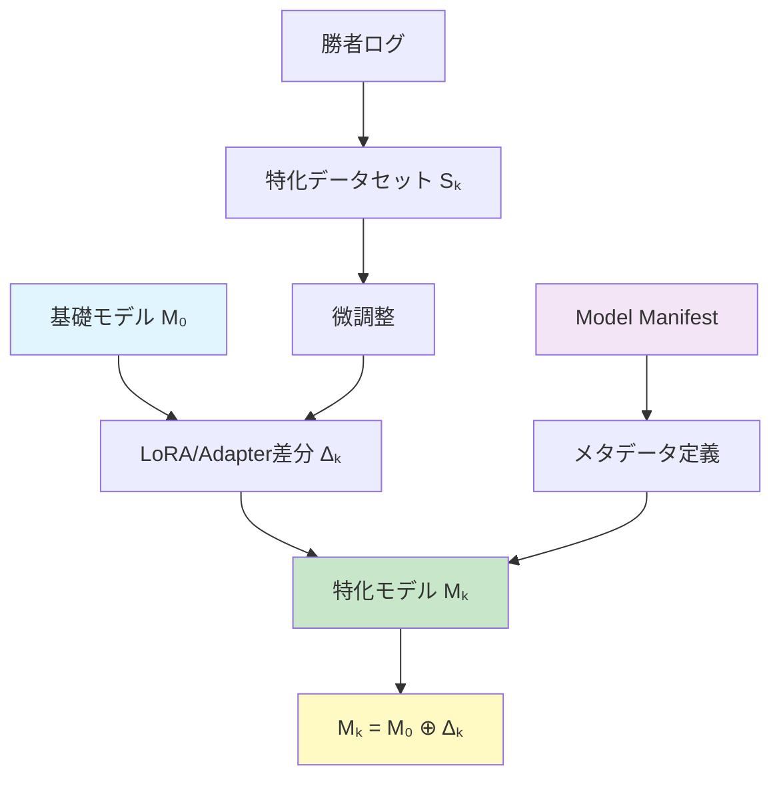
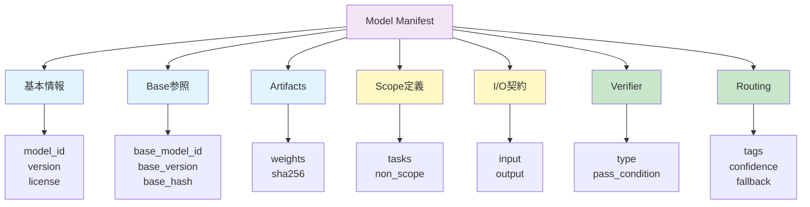

# 特化モデルの定義と要件

## 1. 基本定義

**特化モデル（Specialist）**とは、ある基礎モデル $M_0$ を起点として、特定の入力分布・タスク集合 $D_k$ に対する性能（品質または計算効率）を改善する目的で微調整されたモデル $M_k$ である。

ここで $M_k$ は、(i) 基礎モデル参照、(ii) 適用範囲（scope）、(iii) 最小品質ゲート（verifier）を持つ。

### 数式的表現

$$M_k = M_0 \oplus \Delta_k$$

詳細は [WHITEPAPER_JP.md](WHITEPAPER_JP.md) 4.1節を参照。

### 特化モデルの構造



### 推奨定義（ホワイトペーパー用）

**特化モデル（Specialist）**とは、ある基礎モデル M₀ を起点として、特定の入力分布・タスク集合 Dₖ に対する性能（品質または計算効率）を改善する目的で微調整されたモデル Mₖ である。

ここで Mₖ は、(i) 基礎モデル参照、(ii) 適用範囲（scope）、(iii) 最小品質ゲート（verifier）を持つ。

### 数式的表現

Mₖ = FineTune(M₀, Sₖ, cfg)

- Sₖ：特化用データ（勝者ログ等から抽出）
- cfg：LoRA等の学習設定

## 2. 追加で必要な「成立条件」（最低限）

ただし厳密には、これは特化モデルであるための**必要条件**で、次が無いと「特化モデル」と呼ぶと事故ります。

### (A) 適用領域（scope）が定義されていること

何に特化しているか（タスク・フォーマット・領域）

### (B) 最小品質条件（verifier）が定義されていること

"速いゴミ"を特化として登録しないため

### (C) ベースへの参照が固定されていること

base model ID / version / hash

この3点が揃って初めて、プロジェクトの目的である「制度的に運用可能な特化モデル」になります。

## 3. 特化モデルの最低伝達仕様（Model Manifest）

これが欠けたモデルは登録拒否（制度）。

### Model Manifest構造



### model.yaml（必須項目）

```yaml
model_id: spec-llm.jsonfixer
version: 0.3.0
base_model:
  model_id: generalist-llm
  version: 1.1.2
  base_hash: "..."

artifacts:
  weights:
    filename: jsonfixer-q4.gguf
    sha256: "..."

license: Apache-2.0

scope:
  tasks:
    - json_transform
    - schema_conform
  non_scope:
    - open_ended_creative_writing
    - medical_advice
    - pii_handling

io_contract:
  input:
    max_tokens: 2048
    required_format: "prompt+schema"
  output:
    format: json
    schema_ref: schemas/output.schema.json

verifier:
  type: json_schema
  pass_condition: "schema_valid == true"

routing:
  tags: ["format:json", "task:transform"]
  recommended_min_confidence: 0.65
  fallback: "generalist-llm"
```

### 必須項目の詳細

1. **model_id, version**
2. **base_model_id, base_version, base_hash**
3. **artifact_hash**（差分ファイルのhash）
4. **license**
5. **scope / non_scope**
6. **io_contract**（入力制約・出力形式）
7. **verifier**（PASS条件）
8. **routing_tags, recommended_min_confidence, fallback**

これで「増殖しても運用が壊れない」。

## 4. "推奨"の追加項目（入れると信頼が上がる）

- **Proxy metrics**：速度/トークン数/計算量など（何で評価してるか）
- **Training summary**：データの由来（勝者ログ由来、合成の割合、期間）
- **Known failure modes**：典型的に壊れる入力例
- **Safety notes**：拒否すべき入力、情報漏洩リスクの扱い
- **Compatibility**：対応ランタイム（llama.cpp / vLLM等）、量子化種別

## 5. MODEL_CARD.md（人間が読む：短くていい）

```markdown
# spec-llm.jsonfixer v0.3.0

## What it does
- JSON変換・整形・スキーマ準拠の出力に特化

## What it does NOT do
- 自由作文、医療/法律助言、個人情報の取り扱い

## Input / Output
- Input: prompt + JSON Schema
- Output: JSON（schemaに必ず準拠）

## Verification
- JSON Schema validator（fail時はgeneralistへfallback）

## Known failure modes
- スキーマが曖昧/矛盾していると誤解釈が増える
```

## 6. 学際性

- **ソフトウェア工学**：仕様・契約（schema, interface, versioning）で事故率を下げる
- **分散システム**：増殖するコンポーネントには識別子・互換性・検証が必須
- **機械学習**：proxy最適化はハックを生むので、verifierとnon-scopeが安全弁になる
- **セキュリティ**：ハッシュ・署名・ライセンス明記は供給網（supply chain）対策

## 7. 応用・転用例

- **FLM的なマルチエンジン運用**：model.yaml をロードして selector が自動登録→最適モデル呼び出し
- **学習ログの整備**：Model IDが固定されるので「どのモデルが勝ったか」の統計が壊れない
- **コミュニティ貢献**：第三者が作った特化モデルでも、Manifestが揃えば安全に取り込める

## 8. 次に考える問い

「プロジェクトで"登録可能な特化モデルの最小要件"を何項目にする？」

おすすめは上の必須A〜Dを必須にして、欠けたら自動でreject（=制度化）です。
