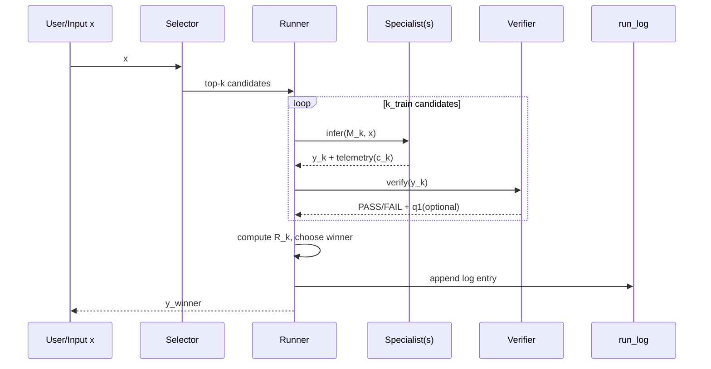

# Distributed Specialist Learning (DSL) Whitepaper v1.3 (Full)

**Subtitle**: Delivering "collectively powerful" responses locally without massive GPUs through distributed "specialist diff sets + routing + verification + pruning"  
**Version**: v1.3 (Full / Operational Specification)  
**Date**: 2025-12-29 (Asia/Tokyo)  
**Status**: Design Spec (Implementation in next phase)

---

## Table of Contents

- [0. Abstract](#0-abstract)
- [1. Goals and Non-Goals](#1-goals-and-non-goals)
- [2. Problem Statement](#2-problem-statement)
- [3. Overview](#3-overview)
- [4. Core Specification (Formal Model)](#4-core-specification-formal-model)
- [5. Learning, Update, and Supply (DL-1/2/3)](#5-learning-update-and-supply-dl-123)
- [6. MVP Specification (JSON Domain)](#6-mvp-specification-json-domain)
- [7. Security and Governance](#7-security-and-governance)
- [8. Evaluation Plan (Falsifiable Hypotheses)](#8-evaluation-plan-falsifiable-hypotheses)
- [9. Limitations and Failure Modes](#9-limitations-and-failure-modes)
- [10. Roadmap](#10-roadmap)
- [Appendix A. Manifest (Model Registration) Specification](#appendix-a-manifest-model-registration-specification)
- [Appendix B. run_log (Audit Log) Specification](#appendix-b-run_log-audit-log-specification)
- [References](#references)
- [ERROR CHECK](#error-check-self-verification)

---

## 0. Abstract

DSL (Distributed Specialist Learning) maintains a **base model $M_0$** that runs locally and a **specialist set** consisting of many **specialist diffs $\Delta_k$** (LoRA/Adapter, etc.), rather than jointly training a single giant model for everyone to use.  
For each input $x$, a **selector (router)** narrows down candidate models, and only **a small number (typically $k_{\mathrm{infer}}=1\sim2$)** are executed locally to return a response.

The initial proposal of "positive feedback only to the fastest model" is prone to collapse, as refusal responses and template short texts can win simply by being fast, causing learning to converge to "fast garbage."  
DSL avoids this by fixing the following **contracts** (MUST) that are resilient to distributed operation:

- **Verifier filtering (hard constraint)**: Only outputs satisfying the contract (PASS) are winner candidates  
- **Speed is reward, not cost**: Selection by quality − $\lambda$·cost − $\pi$·refusal penalty  
- **Exploration quota + top-k evaluation**: Structurally prevents single dominance and cold-start of new specialists  
- **spawn/prune (proliferation and pruning)**: Increase uncovered domains, remove duplicates/worthless/malicious  
- **Metric Registry (metric replacement)**: Update metrics when gamed, migrate in mixed form  
- **manifest/audit log/schema/governance**: Ensures supply chain, reproducibility, and auditability

---

## 1. Goals and Non-Goals

### 1.1 Goals

- **G1**: Participants without large-scale GPUs can obtain "powerful response experience" (inference is local-centric)  
- **G2**: Specialist model sets automatically differentiate and strengthen through winner logs (auto-classification → update)  
- **G3**: Operational contracts that do not break under distributed participation (verification, audit, pruning, metric replacement)

### 1.2 Non-Goals

- **NG1**: Aggregating a single giant model (one) via FedAvg, etc., to create the strongest (future feature)  
- **NG2**: Starting from domains where Verifier is weak (not done in MVP)  
- **NG3**: Governance dependent on trust (real name/reputation) (ultimately relies on "verification")

---

## 2. Problem Statement

### 2.1 What is Difficult (Failure Patterns)

1) **Placing reward on speed leads to collapse**: Refusals, short texts, and templates win simply by being "fast"  
2) **Inference explodes with model count**: Running all models every time does not work locally  
3) **Distributed assumes contamination and tampering**: Diffs, logs, and metrics are attacked  
4) **Fixed metrics are gamed**: Optimization becomes metric hacking

### 2.2 Relationship to Related Concepts

- **MoE**: Gates to execute only some experts, reducing computation  
  - DSL externalizes MoE's "experts" as diffs and further includes distributed operation (supply chain)
- **Federated Learning (FedAvg)**: Aggregates updates into a single model  
  - DSL MVP prioritizes "submission (non-aggregation) + routing + pruning" (avoids synchronization and trust costs)
- **Distillation**: Teacher → student  
  - DSL uses winner logs as teacher signals and can combine distillation as a "later stage" (future)

---

## 3. Overview

### 3.1 Components

- **Base Model**: $M_0$ (foundation for local inference)  
- **Specialists**: $\{M_k = M_0 \oplus \Delta_k\}$ (increase via diffs)  
- **Selector**: Selects candidates $k_{\mathrm{train}}$ / execution $k_{\mathrm{infer}}$ from input $x$  
- **Verifier**: Determines whether output satisfies contract (PASS/FAIL)  
- **Registry**: Version management of manifest, metrics, and audit sets  
- **Runner**: Implementation that executes route→infer→verify→log

### 3.2 Data Flow (Execution Layer and Learning Layer)



- **Execution layer (inference)**: Fix $k_{\mathrm{infer}}$ to 1-2, keeping local cost constant  
- **Learning layer (evaluation, update)**: Run $k_{\mathrm{train}}$ to create winner logs and pass to updates

---

## 4. Core Specification (Formal Model)

### 4.1 Models and Diffs

- Base model: $M_0$  
- Specialist diff: $\Delta_k$  
- Specialist model:  
  $$M_k = M_0 \oplus \Delta_k$$

$\oplus$ is the operation that makes inference possible by applying the diff (e.g., LoRA injection).

### 4.2 Verifier and PASS Set

For output $y_k=M_k(x)$, contract verification:

$$\mathcal{C}(x)=\{k \mid V(y_k)=\mathrm{PASS}\}$$

**Fallback (MUST)**: If $\mathcal{C}(x)=\varnothing$, fix one of the following in the manifest:  
- `fallback=[base]`: Fall back to $M_0$  
- `fallback=[unsure]`: Return structured "UNSURE" (defined in schema for JSON)

### 4.3 Two-Layer Quality (q0/q1)

- $q_0 \in \{0,1\}$: Verifier PASS (whether contract is satisfied)  
- $q_1(x)\in[0,1]$: Task-specific score (separate from Verifier, measure of superiority)

**Reason**: PASS/FAIL alone cannot distinguish "PASS but poor quality."  
Conversely, making $q_1$ ambiguous causes the system to break due to evaluation hacking. Therefore, **separate q0/q1** and make q0 an absolute constraint.

### 4.4 Cost c and "Treatment of Speed"

Speed is **cost**, not "goodness." Examples:

- $t_{\mathrm{total}}$: Total time (ms)  
- $t_{\mathrm{ttft}}$: Time to first token (ms)  
- $\mathrm{tokens\_out}$: Output token count  
- $m$: Maximum memory (MB)

Costs are normalized and combined (time and tokens are sufficient for MVP):

$$c_k(x)=w_t \cdot \widehat{t_{\mathrm{total}}} + w_o \cdot \widehat{\mathrm{tokens\_out}}$$

### 4.5 Composite Reward R and Winner

$$
R_k(x)= q_0 + \beta q_1(x) - \lambda c_k(x) - \pi\cdot\mathrm{RefusalPenalty}_k(x)
$$

Winner:

$$k^*(x)=\arg\max_{k\in\mathcal{C}(x)} R_k(x)$$

**RefusalPenalty (MUST)**: Explicitly penalize refusals, evasions, and empty content.  
(For JSON domain, "empty output," "missing required," "required keys not generated" can be treated as refusals)

---

## 5. Learning, Update, and Supply (DL-1/2/3)

### 5.1 DL-1: Distributed Evaluation (Winner Log Generation)

**Input**: Batch $B=\{x_i\}$, candidate set, metric_version, audit_set_version  
**Output**: `run_log.jsonl`

Procedure (MUST):

1. `route(x)` → $k_{\mathrm{train}}$ candidates  
2. Infer candidates (parallelizable)  
3. `verify` (q0) + (if possible) `score` (q1)  
4. Compute $R$ → winner  
5. Record to log

### 5.2 DL-2: Distributed Update (Diff Submission)

**Basic policy**: Updates are "submissions," not "aggregation."  
Each updater improves $\Delta_k$ using winner set $S_k=\{x\mid k^*(x)=k\}$ as training data and **submits as a diff**.

- Submission: $\Delta_k$ (LoRA/Adapter, etc.) + manifest (required)  
- Acceptance condition: hash match + verifier contract match + no regression on audit set (stable condition)

### 5.3 DL-3: Distributed Supply (Verification, Signature, Pruning)

Distributed assumes "poison" will be mixed in, so the supply chain is contract-based.

- **Hash required**: Fix base/delta/manifest with sha256  
- **Signature recommended**: Required for stable  
- **Audit set**: Detect regression and maliciousness with fixed inputs  
- **prune**: Eliminate low PASS rate, supply chain violations, audit failures, long-term non-winners

---

## 6. MVP Specification (JSON Domain)

### 6.1 Why JSON (MVP Suitability)

- Verifier is cheap: PASS/FAIL is mechanically determined by JSON Schema  
- Resistant to contamination: Output format is fixed, refusals and junk text are unlikely to win  
- $q_1$ is easy to design: Can define partial match or structure match rate

### 6.2 Input/Output Contract (Example)

- Input: Natural language + reference text  
- Output: JSON conforming to specified schema

Example (output schema image):

```json
{
  "type": "object",
  "required": ["title", "summary", "entities"],
  "properties": {
    "title": { "type": "string", "minLength": 1 },
    "summary": { "type": "string", "minLength": 1 },
    "entities": {
      "type": "array",
      "items": { "type": "string" },
      "minItems": 0
    }
  }
}
```

### 6.3 Verifier (q0) Definition

- PASS: Parseable as JSON + passes JSON Schema  
- FAIL: Unparseable / missing required / type mismatch / empty

This blocks the path for "fast refusals" and "fast templates" to become winners.

### 6.4 $q_1$ (Quality Score) Concrete Formula (MVP)

MVP assumes "correct JSON" exists (auto-generated data is acceptable).  
For target output $y^*$ and candidate $y$:

- Key set match: $J=\mathrm{Jaccard}(\mathrm{keys}(y),\mathrm{keys}(y^*))$  
- String field similarity: $S=\mathrm{avg}(\mathrm{sim}(y[f],y^*[f]))$ (e.g., token F1 / character N-gram)  
- Array field match: $A=\mathrm{avg}(\mathrm{set\_F1}(y[f],y^*[f]))$

Combined:

$$q_1 = \alpha J + (1-\alpha)\cdot \frac{S+A}{2}$$

MVP initial value: $\alpha=0.4$ (slightly emphasizes structure)

### 6.5 Cost c (How to Include Speed)

Measured values: `load_ms, gen_ms, ttft_ms, tps, total_ms, tokens_out`

MVP cost:

$$c = \widehat{\mathrm{total\_ms}} + 0.2\cdot \widehat{\mathrm{tokens\_out}}$$

(If you want to include `ttft_ms`, you can decompose total_ms)

### 6.6 Exploration and Inference Fixed Values (Initial Range)

| parameter | Recommended initial value | Meaning |
|---|---:|---|
| $k_{\mathrm{infer}}$ | 1-2 | Number of models to execute in inference (fixed) |
| $k_{\mathrm{train}}$ | 4 | Number of candidates to compare in learning log generation |
| $n_{\min}$ | 50 | quota: Minimum trials per model/generation |
| $\tau$ | 0.15 | spawn weakness threshold (R-based) |
| $\rho$ | 0.08 | spawn ratio threshold |
| $\lambda$ | 0.3 | Cost weight |
| $\pi$ | 1.0 | Refusal penalty |
| $\beta$ | 1.0 | $q_1$ weight |
| $\tau_s$ | 0.25 | soft-label temperature |

### 6.7 Measurement Protocol (MUST)

- Separate `load_ms` and `gen_ms`  
- Separate `TTFT/TPS/total_ms/tokens_out`  
- Measure 3 times per input → median  
- Record warm/cold in log (manage cache contamination)

---

## 7. Security and Governance

### 7.1 Threat Model (Minimum)

| Threat | Example | Impact | MUST Countermeasure |
|---|---|---|---|
| Supply chain contamination | Diff tampering/fake manifest | Backdoor | Hash required, signature required for stable |
| Data contamination | poisoning/backdoor | Specialist distortion | Audit set + prune |
| Evaluation hacking | Verifier bypass | Fast garbage revival | Verifier strengthening + metric replacement |
| Sybil | Multiple participation | Registry collapse | Rely on "verification" not trust |

### 7.2 Registry Hierarchy

- **experimental**: Hash+manifest required. Anyone can register  
- **stable**: Signature required + audit set PASS + automatic review (regression detection)

### 7.3 Metric Registry (Metric Replacement)

Fixed metrics are gamed. Therefore, version-manage metrics and allow mixed migration:

$$R=\alpha R^{(v1)}+(1-\alpha)R^{(v2)}$$

Always record `metric_version` in logs.

---

## 8. Evaluation Plan (Falsifiable Hypotheses)

### 8.1 Definition of Success

Compared to base model $M_0$ alone:

- PASS rate improves  
- $q_1$ median improves  
- Inference cost does not explode with $k_{\mathrm{infer}}$ fixed  
- Supply chain violations and audit failures are detected and pruned

### 8.2 Hypotheses (H/T/D/C/U)

#### H1 (Collectively Strong)

- **H**: DSL improves PASS rate and $q_1$ median over $M_0$  
- **T**: JSON, $n\ge 300$, same environment, median of 3 measurements  
- **D**: PASS rate +10pt and $q_1$ median improvement → PASS  
- **C**: If no improvement → strengthen verifier / redesign $q_1$ / improve selector / adjust spawn conditions  
- **U**: Input bias, measurement contamination, $q_1$ design weakness

#### H2 (Avoid Single Dominance)

- **H**: quota + top-k exploration can prevent extreme concentration of winner distribution  
- **T**: Measure maximum win rate and entropy of winner distribution per generation  
- **D**: Maintain maximum win rate < 0.6 → PASS, >0.9 continues → FAIL  
- **C**: Strengthen exploration, increase quota, replace metrics, strengthen pruning  
- **U**: Too few models, weak exploration

---

## 9. Limitations and Failure Modes

- Starting in domains where Verifier is weak → fast garbage, bypass, learning collapse  
- Weak Selector → local execution fails as candidates increase  
- Excessive spawn → registry bloats, evaluation cost increases  
- Insufficient prune → corruption and contamination accumulate  
- Weak supply chain contract → cannot stop tampering and backdoor insertion

---

## 10. Roadmap

- **Phase 0**: Fix verifier/measurement for JSON (MVP of this whitepaper)  
- **Phase 1**: 2-5 specialists, winner log generation (DL-1)  
- **Phase 2**: Selector learning, fix inference to $k_{\mathrm{infer}}=1\sim2$  
- **Phase 3**: spawn/prune operation (DL-2 submission type)  
- **Phase 4**: Stable operation (audit set + signature + metric replacement)

---

## Appendix A. Manifest (Model Registration) Specification

Minimum required fields (example).

```json
{
  "model_id": "dsl.json.extract.v1",
  "version": "1.0.0",
  "base": {
    "model_id": "base.local.llm",
    "base_version": "0.1.0",
    "base_hash": "sha256:..."
  },
  "delta": {
    "type": "lora",
    "artifact": "delta.bin",
    "delta_hash": "sha256:..."
  },
  "license": "Apache-2.0",
  "scope": ["json"],
  "non_scope": ["medical", "legal"],
  "io_contract": {
    "max_input_tokens": 4096,
    "max_output_tokens": 512,
    "output_schema": "schemas/output.schema.json"
  },
  "verifier": {
    "type": "jsonschema",
    "schema": "schemas/output.schema.json"
  },
  "routing": {
    "tags": ["extract", "summary"],
    "min_confidence": 0.35,
    "fallback": ["base"],
    "recommended_k_infer": 2
  }
}
```

---

## Appendix B. run_log (Audit Log) Specification

One line = one input in JSONL. Records telemetry per candidate and winner.

```json
{
  "ts": "2025-12-29T10:00:00+09:00",
  "x_id": "uuid",
  "env_fingerprint": {
    "cpu": "Ryzen...",
    "gpu": "RTX...",
    "runtime": "llama.cpp",
    "quant": "Q4_K_M",
    "threads": 8
  },
  "metric_version": "metric_v1",
  "audit_set_version": "audit_v1",
  "candidates": [
    {
      "model_id": "dsl.json.extract.v1",
      "load_ms": 12,
      "gen_ms": 808,
      "ttft_ms": 120,
      "tps": 35.1,
      "total_ms": 820,
      "tokens_out": 180,
      "verifier": "PASS",
      "q0": 1,
      "q1": 0.71,
      "c": 0.33,
      "refusal_penalty": 0.0,
      "R": 1.38
    }
  ],
  "winner": "dsl.json.extract.v1"
}
```

---

## References

- Switch Transformers: arXiv:2101.03961  
- LoRA: arXiv:2106.09685  
- QLoRA: arXiv:2305.14314  
- FedAvg: arXiv:1602.05629  
- Thompson Sampling tutorial: arXiv:1707.02038  
- Population Based Training: arXiv:1711.09846

---

## ERROR CHECK (Self-Verification)

- Prohibited "speed-only reinforcement," corrected to Verifier + composite reward (fast garbage countermeasure)  
- Separated $q$ into two layers ($q_0$=contract, $q_1$=task score) to resolve ambiguity  
- Documented selector learning teacher signal (soft label) and quota-based cold-start countermeasure  
- Decomposed distributed learning into DL-1/2/3, specifying responsibilities and attack surfaces  
- Added MVP fixed values and measurement protocol, making it an operational "contract"
