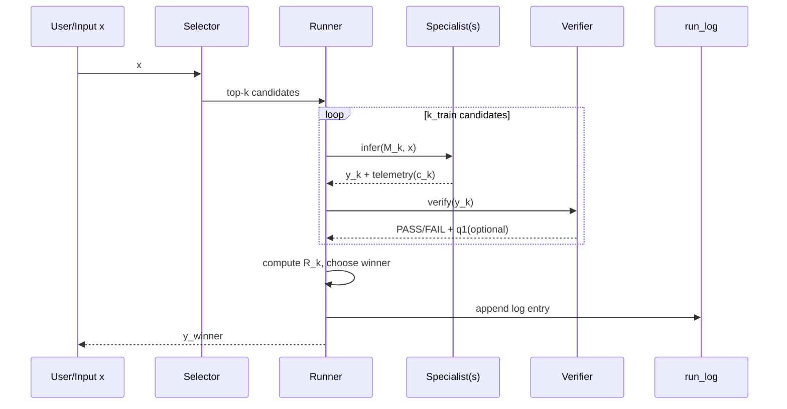

# Distributed Specialist Learning (DSL) Whitepaper v1.3（Full）

**副題**: 分散「特化差分集合 + ルーティング + 検証 + 淘汰」で、巨大GPUなしでも“集合として強い”応答をローカルに届ける  
**版**: v1.3（Full / 運用可能仕様）  
**日付**: 2025-12-29（Asia/Tokyo）  
**状態**: Design Spec（実装は次工程）  

---

## 目次

- [0. 要旨](#0-要旨abstract)
- [1. 目的と非目的](#1-目的と非目的)
- [2. 問題設定](#2-問題設定)
- [3. 全体像](#3-全体像)
- [4. コア仕様（形式モデル）](#4-コア仕様形式モデル)
- [5. 学習・更新・供給（DL-1/2/3）](#5-学習更新供給dl-12-3)
- [6. MVP仕様（JSONドメイン）](#6-mvp仕様jsonドメイン)
- [7. セキュリティとガバナンス](#7-セキュリティとガバナンス)
- [8. 評価計画（反証可能仮説）](#8-評価計画反証可能仮説)
- [9. 限界と失敗モード](#9-限界と失敗モード)
- [10. ロードマップ](#10-ロードマップ)
- [付録A. Manifest（モデル登録）仕様](#付録a-manifestモデル登録仕様)
- [付録B. run_log（監査ログ）仕様](#付録b-run_log監査ログ仕様)
- [参考文献](#参考文献)
- [ERROR CHECK](#error-check自己検証)

---

## 0. 要旨（Abstract）

DSL（Distributed Specialist Learning）は、単一の巨大モデルを共同訓練して全員が同じモデルを使う方式ではなく、**ローカルで動く基礎モデル $M_0$** と、多数の **特化差分 $\Delta_k$**（LoRA/Adapter 等）からなる **専門家集合**を維持する。  
入力 $x$ ごとに **selector（ルータ）**が候補モデルを絞り、ローカルで **少数（通常 $k_{\mathrm{infer}}=1\sim2$）だけ実行**して応答を返す。

初期の原案「最速モデルだけに正のフィードバック」は、拒否応答やテンプレ短文が速いだけで勝ちやすく、学習が“速いゴミ”へ収束して破綻する可能性が高い。  
DSLはこれを避けるため、分散運用に耐える **契約**を以下に固定する（MUST）。

- **Verifier足切り（ハード制約）**：契約を満たす出力（PASS）のみ勝者候補  
- **速度は報酬ではなくコスト**：品質 − $\lambda$·コスト − $\pi$·拒否ペナルティで選抜  
- **探索 quota + top-k 評価**：単一支配と新規専門家の冷遇を構造的に防止  
- **spawn/prune（増殖と淘汰）**：未カバー領域は増やし、重複/無価値/悪性は落とす  
- **Metric Registry（指標置換）**：ゲーム化されたら指標を更新し混在移行  
- **manifest/監査ログ/スキーマ/ガバナンス**：供給網・再現性・監査性を担保

---

## 1. 目的と非目的

### 1.1 目的（Goal）

- **G1**：大規模GPUを持たない参加者でも「強い応答体験」を得られる（推論はローカル中心）  
- **G2**：特化モデル集合が、勝者ログにより自動的に分化・強化される（自動分類→更新）  
- **G3**：分散参加でも壊れない運用契約（検証・監査・淘汰・指標置換）

### 1.2 非目的（Non-Goals）

- **NG1**：単一巨大モデル（1本）をFedAvg等で集約して最強を作る（将来機能）  
- **NG2**：Verifierが弱い領域からの開始（MVPではやらない）  
- **NG3**：信頼（実名/評判）に依存したガバナンス（最終は“検証”）

---

## 2. 問題設定

### 2.1 何が難しいか（失敗パターン）

1) **速度に報酬を置くと破綻**：拒否・短文・テンプレが“速い”だけで勝者になる  
2) **モデル数増で推論が爆発**：毎回全モデルを回すとローカルでは成立しない  
3) **分散は汚染と改竄が前提**：差分・ログ・指標は攻撃される  
4) **固定指標はゲーム化される**：最適化が指標ハックに化ける

### 2.2 近縁概念との位置づけ

- **MoE**：ゲーティングで一部専門家だけ実行し計算を抑える  
  - DSLはMoEの「専門家」を差分として外部化し、さらに分散運用（供給網）まで含めたもの
- **Federated Learning（FedAvg）**：更新を集約して単一モデルへ  
  - DSLのMVPは「提出（非集約）＋ルーティング＋淘汰」を優先する（同期・信頼コストを避ける）
- **Distillation（蒸留）**：教師→生徒  
  - DSLは勝者ログを教師信号にし、蒸留を“後段”で併用可能（将来）

---

## 3. 全体像

### 3.1 コンポーネント

- **Base Model**：$M_0$（ローカル推論の土台）  
- **Specialists**：$\{M_k = M_0 \oplus \Delta_k\}$（差分で増やす）  
- **Selector**：入力 $x$ から候補 $k_{\mathrm{train}}$ / 実行 $k_{\mathrm{infer}}$ を選ぶ  
- **Verifier**：出力が契約を満たすか判定（PASS/FAIL）  
- **Registry**：manifest・指標・監査セットの版管理  
- **Runner**：route→infer→verify→log を実行する実装体

### 3.2 データフロー（実行層と学習層）



- **実行層（推論）**：$k_{\mathrm{infer}}$ を 1〜2 に固定し、ローカルコストを一定化  
- **学習層（評価・更新）**：$k_{\mathrm{train}}$ を回して勝者ログを作り、更新へ渡す

---

## 4. コア仕様（形式モデル）

### 4.1 モデルと差分

- 基礎モデル：$M_0$  
- 特化差分：$\Delta_k$  
- 特化モデル：  
  $$M_k = M_0 \oplus \Delta_k$$

$\oplus$ は「差分適用（LoRA注入など）により推論可能にする操作」。

### 4.2 Verifier と PASS集合

出力 $y_k=M_k(x)$ に対し契約検証：

$$\mathcal{C}(x)=\{k \mid V(y_k)=\mathrm{PASS}\}$$

**フォールバック（MUST）**：$\mathcal{C}(x)=\varnothing$ の場合は、次のいずれかを manifest で固定する。  
- `fallback=[base]`：$M_0$ に戻す  
- `fallback=[unsure]`：構造化された “UNSURE” を返す（JSONならスキーマで定義）

### 4.3 品質の二層化（q0/q1）

- $q_0 \in \{0,1\}$：Verifier PASS（契約を満たしたか）  
- $q_1(x)\in[0,1]$：タスク固有スコア（Verifierとは別。優劣の尺度）  

**理由**：PASS/FAILだけでは「PASSするが出来が悪い」を区別できない。  
逆に $q_1$ を曖昧にすると、評価ハックで制度が壊れる。よって **q0/q1を分離**し、q0は絶対制約にする。

### 4.4 コスト c と「速度の扱い」

速度は“良さ”ではなく **コスト**。例：

- $t_{\mathrm{total}}$：総時間（ms）  
- $t_{\mathrm{ttft}}$：最初のトークンまでの時間（ms）  
- $\mathrm{tokens\_out}$：出力トークン数  
- $m$：最大メモリ（MB）

コストは正規化して合成する（MVPでは時間とトークンだけで良い）：

$$c_k(x)=w_t \cdot \widehat{t_{\mathrm{total}}} + w_o \cdot \widehat{\mathrm{tokens\_out}}$$

### 4.5 合成報酬 R と勝者

$$
R_k(x)= q_0 + \beta q_1(x) - \lambda c_k(x) - \pi\cdot\mathrm{RefusalPenalty}_k(x)
$$

勝者：

$$k^*(x)=\arg\max_{k\in\mathcal{C}(x)} R_k(x)$$

**RefusalPenalty（MUST）**：拒否・回避・無内容を明示的に罰する。  
（JSONドメインなら「出力が空」「required欠落」「必須キー未生成」などを拒否扱い可能）

---

## 5. 学習・更新・供給（DL-1/2/3）

### 5.1 DL-1：分散評価（勝者ログ生成）

**入力**：バッチ $B=\{x_i\}$、候補集合、metric_version、audit_set_version  
**出力**：`run_log.jsonl`

手順（MUST）：

1. `route(x)` → $k_{\mathrm{train}}$ 候補  
2. 候補を推論（並列可）  
3. `verify`（q0）＋（可能なら）`score`（q1）  
4. $R$ 計算→勝者  
5. ログへ記録

### 5.2 DL-2：分散更新（差分の提出）

**基本方針**：更新は「集約」ではなく「提出」。  
各更新者は、勝者集合 $S_k=\{x\mid k^*(x)=k\}$ を教師データにして $\Delta_k$ を改善し、**差分として提出**する。

- 提出物：$\Delta_k$（LoRA/Adapter等）＋ manifest（必須）  
- 受入条件：hash一致 + verifier契約一致 + 監査セットで退行しない（stable条件）

### 5.3 DL-3：分散供給（検証・署名・淘汰）

分散では“毒”が混ざる前提なので、供給網を契約化する。

- **hash必須**：base/delta/manifest を sha256 で固定  
- **署名推奨**：stableでは必須化  
- **監査セット**：固定入力で退行や悪性を検知  
- **prune**：PASS率低下・供給網違反・監査失敗・長期不勝は淘汰

---

## 6. MVP仕様（JSONドメイン）

### 6.1 なぜJSONなのか（MVP適性）

- Verifierが安い：JSON SchemaでPASS/FAILが機械的に決まる  
- 汚染に強い：出力形式が固定され、拒否や雑文が勝ちにくい  
- $q_1$ が設計しやすい：部分一致や構造一致率を定義できる

### 6.2 入出力契約（例）

- 入力：自然言語 + 参照テキスト  
- 出力：指定スキーマに従うJSON

例（出力スキーマのイメージ）：

```json
{
  "type": "object",
  "required": ["title", "summary", "entities"],
  "properties": {
    "title": { "type": "string", "minLength": 1 },
    "summary": { "type": "string", "minLength": 1 },
    "entities": {
      "type": "array",
      "items": { "type": "string" },
      "minItems": 0
    }
  }
}
```

### 6.3 Verifier（q0）の定義

- PASS：JSONとしてparse可能 + JSON Schemaに合格  
- FAIL：parse不能 / required欠落 / 型不一致 / 空

これで「速い拒否」「速いテンプレ」が勝者になる道を遮断する。

### 6.4 $q_1$（優劣スコア）の具体式（MVP）

MVPでは「正解JSON」がある前提を置く（自動生成データでもよい）。  
目標出力を $y^\*$、候補を $y$ として：

- キー集合の一致：$J=\mathrm{Jaccard}(\mathrm{keys}(y),\mathrm{keys}(y^\*))$  
- 文字列フィールドの類似：$S=\mathrm{avg}(\mathrm{sim}(y[f],y^\*[f]))$（例：token F1 / 文字N-gram）  
- 配列フィールドの一致：$A=\mathrm{avg}(\mathrm{set\_F1}(y[f],y^\*[f]))$

合成：

$$q_1 = \alpha J + (1-\alpha)\cdot \frac{S+A}{2}$$

MVP初期値：$\alpha=0.4$（構造をやや重視）

### 6.5 コスト c（速度の入れ方）

測定値：`load_ms, gen_ms, ttft_ms, tps, total_ms, tokens_out`

MVPのコスト：

$$c = \widehat{\mathrm{total\_ms}} + 0.2\cdot \widehat{\mathrm{tokens\_out}}$$

（`ttft_ms` を入れたいなら total_ms を分解してもよい）

### 6.6 探索・推論の固定値（初期レンジ）

| parameter | 推奨初期値 | 意味 |
|---|---:|---|
| $k_{\mathrm{infer}}$ | 1〜2 | 推論で実行するモデル数（固定） |
| $k_{\mathrm{train}}$ | 4 | 学習ログ生成で比較する候補数 |
| $n_{\min}$ | 50 | quota：各モデル最低試行数/世代 |
| $\tau$ | 0.15 | spawn弱さ閾値（R基準） |
| $\rho$ | 0.08 | spawn割合閾値 |
| $\lambda$ | 0.3 | コスト重み |
| $\pi$ | 1.0 | 拒否ペナルティ |
| $\beta$ | 1.0 | $q_1$ 重み |
| $\tau_s$ | 0.25 | soft-label温度 |

### 6.7 計測プロトコル（MUST）

- `load_ms` と `gen_ms` を分離  
- `TTFT/TPS/total_ms/tokens_out` を分離  
- 1入力3回測定→中央値  
- warm/cold をログに記録（キャッシュ汚染を管理）

---

## 7. セキュリティとガバナンス

### 7.1 脅威モデル（最低限）

| 脅威 | 例 | 影響 | MUST対策 |
|---|---|---|---|
| 供給網汚染 | 差分改竄/偽manifest | バックドア | hash必須、stableで署名必須 |
| データ汚染 | poisoning/backdoor | 特化が歪む | 監査セット + prune |
| 評価ハック | verifierすり抜け | 速いゴミ復活 | verifier強化 + 指標置換 |
| Sybil | 多重参加 | レジストリ崩壊 | 信用でなく“検証”に寄せる |

### 7.2 レジストリ階層

- **experimental**：hash+manifest必須。誰でも登録可  
- **stable**：署名必須 + 監査セットPASS + 自動レビュー（退行検知）

### 7.3 Metric Registry（指標置換）

固定指標はゲーム化される。よって metric を版管理し、混在移行を許す：

$$R=\alpha R^{(v1)}+(1-\alpha)R^{(v2)}$$

ログには必ず `metric_version` を記録する。

---

## 8. 評価計画（反証可能仮説）

### 8.1 成功の定義

基礎モデル $M_0$ 単体に比べて：

- PASS率が改善  
- $q_1$ 中央値が改善  
- 推論は $k_{\mathrm{infer}}$ 固定でコストが爆発しない  
- 供給網違反・監査失敗が検出され prune される

### 8.2 仮説（H/T/D/C/U）

#### H1（集合として強い）
- **H**：DSLは $M_0$ より PASS率と $q_1$ 中央値を改善する  
- **T**：JSON、$n\ge 300$、同一環境、3回測定中央値  
- **D**：PASS率 +10pt かつ $q_1$ 中央値改善 → PASS  
- **C**：改善しない→ verifier強化 / $q_1$再設計 / selector改善 / spawn条件調整  
- **U**：入力偏り、測定汚染、$q_1$設計の弱さ

#### H2（単一支配を回避）
- **H**：quota + top-k探索で勝者分布の極端集中を防げる  
- **T**：勝者分布の最大勝率・エントロピーを世代ごとに計測  
- **D**：最大勝率 < 0.6 を維持 → PASS、>0.9が継続 → FAIL  
- **C**：探索強化、quota増、指標置換、prune強化  
- **U**：モデル数が少なすぎる、探索が弱い

---

## 9. 限界と失敗モード

- Verifierが弱い領域で開始 → 速いゴミ、すり抜け、学習崩壊  
- Selectorが弱い → 候補が増えるほどローカルで回らない  
- spawn過多 → レジストリが肥大、評価コスト増  
- prune不足 → 腐敗・汚染が蓄積  
- 供給網契約が弱い → 改竄やバックドア混入を止められない

---

## 10. ロードマップ

- **Phase 0**：JSONで verifier/計測を固定（この白書のMVP）  
- **Phase 1**：特化2〜5、勝者ログ生成（DL-1）  
- **Phase 2**：selector学習、推論を $k_{\mathrm{infer}}=1\sim2$ 固定  
- **Phase 3**：spawn/prune運用（DL-2提出型）  
- **Phase 4**：stable運用（監査セット + 署名 + 指標置換）

---

## 付録A. Manifest（モデル登録）仕様

最低限の必須フィールド（例）。

```json
{
  "model_id": "dsl.json.extract.v1",
  "version": "1.0.0",
  "base": {
    "model_id": "base.local.llm",
    "base_version": "0.1.0",
    "base_hash": "sha256:..."
  },
  "delta": {
    "type": "lora",
    "artifact": "delta.bin",
    "delta_hash": "sha256:..."
  },
  "license": "Apache-2.0",
  "scope": ["json"],
  "non_scope": ["medical", "legal"],
  "io_contract": {
    "max_input_tokens": 4096,
    "max_output_tokens": 512,
    "output_schema": "schemas/output.schema.json"
  },
  "verifier": {
    "type": "jsonschema",
    "schema": "schemas/output.schema.json"
  },
  "routing": {
    "tags": ["extract", "summary"],
    "min_confidence": 0.35,
    "fallback": ["base"],
    "recommended_k_infer": 2
  }
}
```

---

## 付録B. run_log（監査ログ）仕様

1行＝1入力の JSONL。候補ごとのテレメトリと勝者を残す。

```json
{
  "ts": "2025-12-29T10:00:00+09:00",
  "x_id": "uuid",
  "env_fingerprint": {
    "cpu": "Ryzen...",
    "gpu": "RTX...",
    "runtime": "llama.cpp",
    "quant": "Q4_K_M",
    "threads": 8
  },
  "metric_version": "metric_v1",
  "audit_set_version": "audit_v1",
  "candidates": [
    {
      "model_id": "dsl.json.extract.v1",
      "load_ms": 12,
      "gen_ms": 808,
      "ttft_ms": 120,
      "tps": 35.1,
      "total_ms": 820,
      "tokens_out": 180,
      "verifier": "PASS",
      "q0": 1,
      "q1": 0.71,
      "c": 0.33,
      "refusal_penalty": 0.0,
      "R": 1.38
    }
  ],
  "winner": "dsl.json.extract.v1"
}
```

---

## 参考文献
- Switch Transformers: arXiv:2101.03961  
- LoRA: arXiv:2106.09685  
- QLoRA: arXiv:2305.14314  
- FedAvg: arXiv:1602.05629  
- Thompson Sampling tutorial: arXiv:1707.02038  
- Population Based Training: arXiv:1711.09846  

---

## ERROR CHECK（自己検証）

- 「速度単独強化」を禁止し、Verifier + 合成報酬に修正（速いゴミ対策）  
- $q$ を二層化（$q_0$=契約、$q_1$=タスクスコア）して曖昧さを解消  
- selector学習の教師信号（soft label）と quota による新規冷遇対策を明文化  
- 分散学習を DL-1/2/3 に分解し、責務と攻撃面を仕様化  
- MVP固定値と計測プロトコルを追加し、運用可能な“契約”に落とした  
